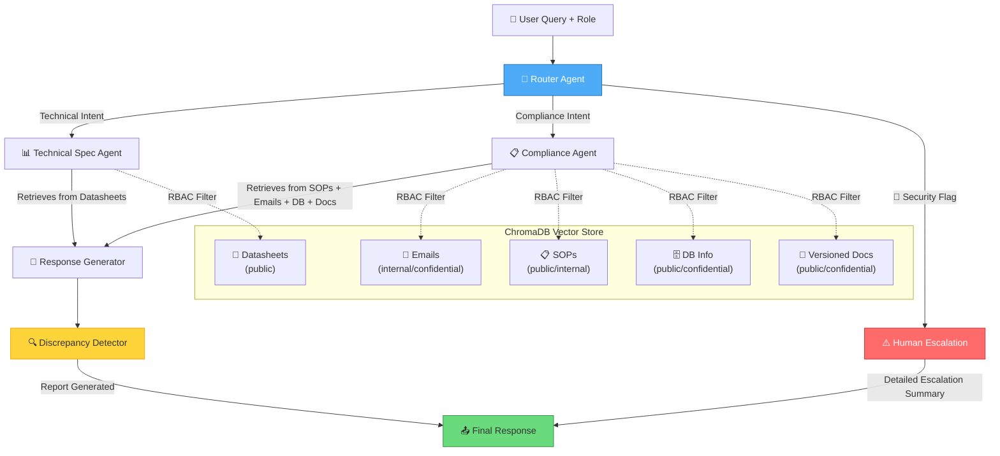

# 🔍 Project VERA — Virtual Engineering Review Agent

> A Multi-Agent System for Technical Document Auditing & Compliance — Adaptable to Any Industry

[](https://python.org)
[](https://github.com/langchain-ai/langgraph)
[](https://www.trychroma.com/)
[](https://ai.google.dev/)
[](https://ollama.com/)

---

## 📋 Table of Contents

- [Overview](#overview)
- [Problem Statement](#problem-statement)
- [Architecture](#architecture)
- [Agent Descriptions](#agent-descriptions)
- [Security Implementation (RBAC)](#security-implementation-rbac)
- [Installation & Setup](#installation--setup)
- [Usage](#usage)
- [Project Structure](#project-structure)
- [Technology Stack](#technology-stack)

---

## Overview

**Project VERA** is an industry-agnostic Multi-Agent System that audits technical documents, emails, and Standard Operating Procedures (SOPs) for compliance issues. While the included demo uses a **semiconductor manufacturing** scenario, VERA's architecture is designed for **any document-heavy industry** — including aerospace, pharmaceuticals, automotive, energy, and more. It supports **two LLM backends**:

- **Google Gemini** (cloud API) — higher quality, requires API key
- **Ollama** (100% local) — no API key needed, runs on your laptop, no rate limits

### Key Capabilities

| Capability | Description |
|-----------|-------------|
| 🔒 **Role-Based Access Control** | Metadata-driven RBAC that filters document retrieval based on user clearance level |
| 📧 **Email Context Analysis** | Searches through ingested email threads to find informal engineering decisions |
| ⚠️ **Discrepancy Detection** | Automatically identifies conflicts between datasheets, emails, DB records, and document versions |
| 🚨 **Human Escalation** | Triggers supervisor review with detailed context summaries for unauthorized access attempts |
| 🤖 **Multi-Agent Orchestration** | LangGraph-based workflow with specialized agents for different document types |
| 🗄️ **DB Info Integration** | Queries structured database records (SQLite-style) for production lot tracking and test results |
| 📑 **Document Version Comparison** | Detects changes between different versions of the same specification document |

---

## Problem Statement

In many industries, **official specifications** (datasheets, manuals) often become outdated when teams make critical decisions via **informal channels** (emails, chat). This creates a dangerous gap. In our demo scenario (semiconductor manufacturing):

```
📄 Datasheet says:     "RTX-9000 max voltage = 5.0V"
📧 Internal email says: "URGENT: Lowering RTX-9000 to 3.3V due to heat failures"
```

**VERA** bridges this gap by:
1. Ingesting ALL document types (datasheets, emails, SOPs)
2. Applying strict access controls so only authorized personnel see sensitive info
3. Automatically detecting and reporting discrepancies between sources
4. Escalating unauthorized access attempts to supervisors

---

## Architecture



### Data Flow

1. **User** submits a query with their role (Senior/Junior)
2. **Router Agent** classifies intent and performs security checks
3. **Retrieval Agent** fetches documents with RBAC metadata filters
4. **Generator** synthesizes a response citing sources
5. **Case Agent** checks for cross-source discrepancies
6. **Final response** delivered (or escalated if unauthorized)

---

## Agent Descriptions

| Agent | LangGraph Node | Role | Input → Output |
|-------|---------------|------|-----------------|
| **🔀 Router** | `route_query` | Classifies query intent (technical/compliance) using keyword matching and performs RBAC security checks | Question → Route decision + security flag |
| **📊 Tech Spec Agent** | `retrieve_specs` | Retrieves from product datasheets with RBAC filtering | Question → Relevant datasheet chunks |
| **📋 Compliance Agent** | `retrieve_compliance` | Retrieves from SOPs, emails, DB info, and versioned documents to find formal procedures, informal decisions, database records, and specification changes | Question → SOP + Email + DB + Document chunks |
| **🤖 Response Generator** | `generate_response` | Synthesizes a comprehensive answer citing all sources | Documents → Natural language response |
| **🔍 Case Agent** | `check_discrepancy` | Detects conflicts between datasheets, emails, DB records, and document versions; generates discrepancy reports | Documents → Discrepancy report (if any) |
| **⚠️ Escalation** | `escalate` | Handles unauthorized access with detailed context summaries of discrepancies/errors/outdated info | Security flag → Detailed escalation notice |

---

## Security Implementation (RBAC)

### How It Works

Project VERA implements **Role-Based Access Control** at the retrieval layer using ChromaDB metadata filtering. This ensures that access controls are enforced *before* any document content reaches the LLM.

```
┌─────────────────────────────────────────────────────────────────┐
│                    RBAC ENFORCEMENT LAYER                       │
├─────────────────────────────────────────────────────────────────┤
│                                                                 │
│  User Role: "senior"                                           │
│  ├── ChromaDB Filter: NONE (access all documents)              │
│  └── Result: Datasheets + Emails + SOPs (all access levels)    │
│                                                                 │
│  User Role: "junior"                                           │
│  ├── ChromaDB Filter: {"access_level": "public"}               │
│  └── Result: Only public datasheets and SOPs                   │
│                                                                 │
│  Security Check (Router):                                      │
│  ├── Junior + Internal query intent → ESCALATE                 │
│  └── Junior + Public query intent → PROCEED with filter        │
│                                                                 │
└─────────────────────────────────────────────────────────────────┘
```

### Access Levels

| Access Level | Senior Engineer (User A) | Junior Intern (User B) |
|-------------|:---:|:---:|
| `public` | ✅ Full Access | ✅ Full Access |
| `internal_only` | ✅ Full Access | ❌ Blocked |
| `confidential` | ✅ Full Access | ❌ Blocked + Escalated |

### RBAC Code Implementation

The RBAC filter is applied in the `retrieve_with_rbac()` function in `app.py`:

```python
# Junior users: ONLY public documents
if user_role == "junior":
    filter_conditions = {"access_level": "public"}

# Senior users: ALL documents (no filter)
elif user_role == "senior":
    filter_conditions = {}  # No restriction

# Query ChromaDB with the filter
results = vector_store.similarity_search(
    query, k=4, filter=filter_conditions
)
```

### Security Layers

1. **Layer 1 — Router Security Check**: Keyword-based intent classification detects if a junior user’s query implies access to restricted information
2. **Layer 2 — Metadata Filtering**: ChromaDB `where` clause filters out non-public documents for junior users
3. **Layer 3 — Escalation**: Flagged queries are routed to the human escalation node instead of retrieval

---

## Installation & Setup

### Prerequisites

- Python 3.10+
- **Option A** — Google Gemini API key ([get one free](https://aistudio.google.com/apikey))
- **Option B** — [Ollama](https://ollama.com/) installed locally (recommended for laptops)

### Step 1: Create Conda Environment

```bash
cd proj_vera
conda env create -f environment.yml
conda activate vera
```

Alternatively, install via pip:

```bash
pip install -r requirements.txt
```

### Step 2: Configure Environment

Create a `.env` file in the project root. Choose your backend:

**Option A — Google Gemini (cloud):**
```env
LLM_BACKEND=gemini
GEMINI_API_KEY=your_gemini_api_key_here
```

**Option B — Ollama (local, no API key needed):**
```bash
# Install Ollama models first
ollama pull hf.co/bartowski/Llama-3.2-1B-Instruct-GGUF
ollama pull hf.co/CompendiumLabs/bge-base-en-v1.5-gguf
```
```env
LLM_BACKEND=ollama
OLLAMA_BASE_URL=http://localhost:11434
OLLAMA_MODEL=hf.co/bartowski/Llama-3.2-1B-Instruct-GGUF
OLLAMA_EMBED_MODEL=hf.co/CompendiumLabs/bge-base-en-v1.5-gguf
```

> **💡 Tip:** Ollama runs entirely on your machine — no internet, no rate limits, no API costs.

### Step 3: Run Data Ingestion

```bash
python ingestion.py
```

This will:
- Create mock documents (datasheets, emails, SOPs) — easily replaceable with real data from any industry
- Split them into chunks with `RecursiveCharacterTextSplitter`
- Generate embeddings using the selected backend (Gemini or Ollama)
- Persist to ChromaDB at `./chroma_db`

> **⚠️ Important:** If you switch backends, re-run `python ingestion.py` to regenerate embeddings with the matching model.

### Step 4: Run the VERA Agent System

**Option A — Interactive Chat UI (recommended):**

```bash
streamlit run streamlit_app.py
```

This opens a browser-based chat interface at `http://localhost:8501` where you can:
- Switch between Senior/Junior roles in the sidebar
- Ask questions interactively
- View retrieved documents, RBAC audit logs, and discrepancy reports
- See the full agent execution trace

**Option B — CLI test scenarios:**

```bash
python app.py
```

This runs 5 automated test scenarios demonstrating:
1. Senior user with full access
2. Junior user with restricted access
3. Junior user triggering escalation (with detailed context)
4. Compliance query with email context
5. DB info + document version discrepancy detection

---

## Usage

### Test Scenarios

| Test | User Role | Query | Expected Behavior |
|------|-----------|-------|-------------------|
| 1 | Senior | "What is the max voltage for RTX-9000?" | Full info including internal email about 3.3V change |
| 2 | Junior | "What is the max voltage for RTX-9000?" | Only public datasheet info (5.0V) |
| 3 | Junior | "Were there internal emails about skipping burn-in?" | **ESCALATED** — access denied with detailed context |
| 4 | Senior | "What are quality audit procedures + recent email changes?" | SOPs + email communications retrieved |
| 5 | Senior | "Compare RTX-9000 spec versions + check production DB" | DB records + versioned docs with version discrepancy report |
| 6 | Senior (semiconductor) | "What are the FDA clinical trial requirements?" | **ESCALATED** — out-of-domain query detected |

---

## Project Structure

```
proj_vera/
├── shared/                 # ⚙️ Shared infrastructure (config, state, loader)
│   ├── config.py           # LLM, VectorStore, RBAC, retry logic
│   ├── graph_state.py      # GraphState TypedDict (state schema)
│   ├── agent_base.py       # @vera_agent decorator
│   └── dynamic_loader.py   # Auto-discovers domain agent subfolders
├── agents_logic/           # 🤖 Agent modules (shared + per-domain)
│   ├── router_agent.py     # Intent + domain routing (keyword-based)
│   ├── response_agent.py   # LLM response generation
│   ├── escalation_agent.py # Security + out-of-domain escalation
│   ├── semiconductor_agents/  # Domain: semiconductor
│   └── medical_agents/        # Domain: medical
├── source_documents/       # 📁 Source data per domain
├── streamlit_app.py        # 🖥️ Interactive Streamlit chat interface
├── app.py                  # Main LangGraph multi-agent application
├── ingestion.py            # Data ingestion pipeline (mock data → ChromaDB)
├── environment.yml         # Conda environment definition
├── requirements.txt        # pip dependencies (alternative)
├── TEAM_GUIDE.md           # Developer guide for team members
├── README.md               # This file
├── .env                    # Environment variables (backend + API keys)
└── chroma_db/              # ChromaDB persistence directory (auto-generated)
```

---

## Technology Stack

| Technology | Purpose | Version |
|-----------|---------|---------|
| **LangGraph** | Multi-agent state machine orchestration | ≥ 0.2.0 |
| **LangChain** | RAG pipeline, prompt management, output parsing | ≥ 0.3.0 |
| **ChromaDB** | Local vector store with metadata filtering | ≥ 0.5.0 |
| **Streamlit** | Interactive chat UI with real-time agent feedback | ≥ 1.40.0 |
| **Google Gemini** | Cloud LLM + Embeddings (Option A) | Latest |
| **Ollama** | Local LLM + Embeddings (Option B) | Latest |
| **Python** | Core runtime | 3.10+ |

---

## 📄 License

This project was developed as a Capstone Project for Data Science & AI certification.

---

*Built with ❤️ using LangGraph, LangChain, ChromaDB, Google Gemini & Ollama*
